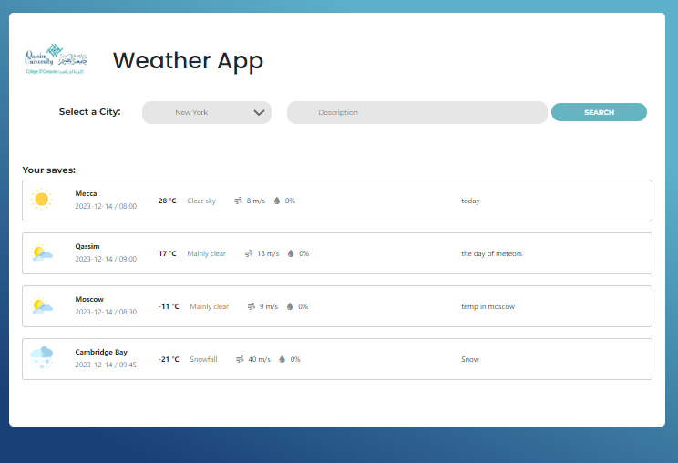
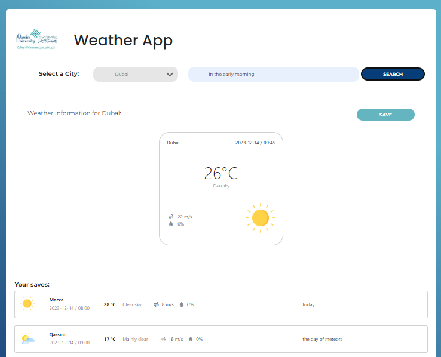

A personal planner that uses an API to incorporate weather information. 

## About The Project


The website is a weather program that allows users to select a city from a predefined list. Once a city is selected, the user can provide notes and descriptions related to the weather for that location. Additionally, the user can choose to click on the search button, which will trigger an API call from the open-meteo website to retrieve weather data for the past four hours. The returned weather data can be saved in the database and presented in visually appealing ways.

### Built With

* [![Bootstrap][Bootstrap.com]][Bootstrap-url]
* [![Flask][flask.palletsprojects.com]][Flask-url]
* [![Docker][docker.com]][Docker-url]
* [![JQuery][JQuery.com]][JQuery-url]

## Getting Started

To ensure the successful implementation of this project, it is imperative to download the Docker software, install [docker](https://www.docker.com/products/docker-desktop/).
### Usage
#### 1- In order to use the project files, your project must contain the data specified in the credentials file.
```ini

PORT=5000
DEBUG = False

# See https://flask.palletsprojects.com/en/3.0.x/quickstart/#sessions
# about how to generate a secret key
SECRET_KEY = Replace this with random string; os.urandom can make one

# the host name for your database service.
HOSTNAME= Replace this with the host name you use

# here provide the name of your mongo database and collection where
# you link your APIs
DATABASE= Replace this name with the name of the mongo db
COLLECTION= Replace this with the name of the mongo collection


```


##### 2- Run the Docker Container and type the following command

```bash
docker-compose up --build
```




#### Users can select a city using the search box and choose to add it to their archives or not.

## Contact
Aseel Aomari - [Qussaim university - 392206377@qu.edu.sa ](392206377@qu.edu.sa)


<!-- MARKDOWN LINKS & IMAGES -->
<!-- https://www.markdownguide.org/basic-syntax/#reference-style-links -->
[Bootstrap.com]: https://img.shields.io/badge/Bootstrap-563D7C?style=for-the-badge&logo=bootstrap&logoColor=white
[Bootstrap-url]: https://getbootstrap.com
[JQuery.com]: https://img.shields.io/badge/jQuery-0769AD?style=for-the-badge&logo=jquery&logoColor=white
[JQuery-url]: https://jquery.com 
[Docker.com]: https://img.shields.io/badge/Docker-2496ED?style=for-the-badge&logo=docker&logoColor=white
[Docker-url]: https://www.docker.com
[Flask.palletsprojects.com]: https://img.shields.io/badge/Flask-000000?style=for-the-badge&logo=flask&logoColor=white
[Flask-url]: https://flask.palletsprojects.com

